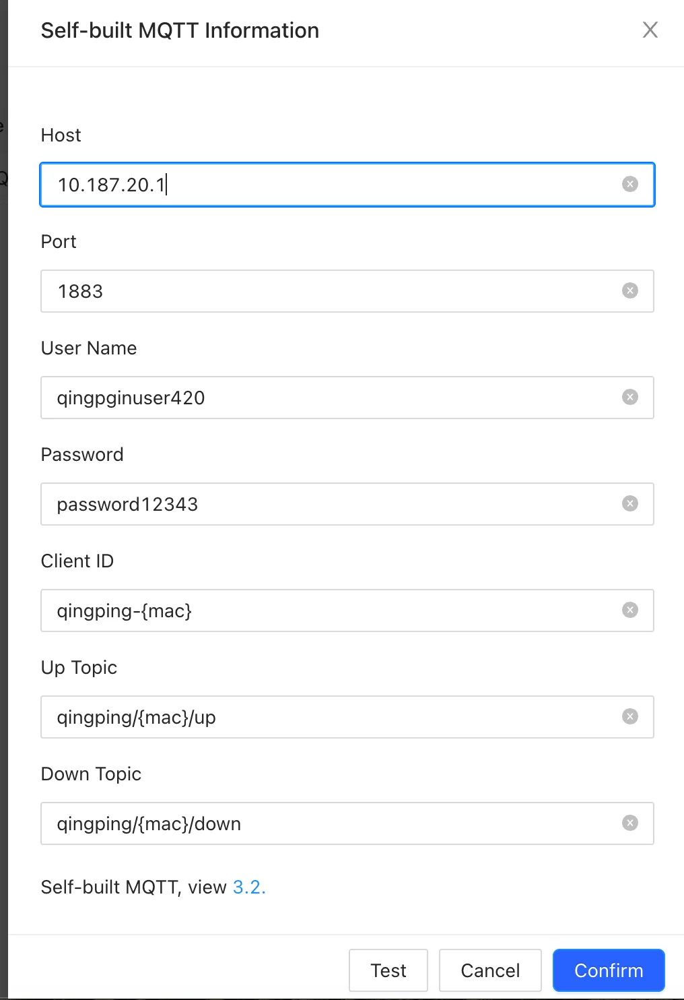

# Qingping Air Monitor Lite - MQTT Setup

## Voraussetzungen
- Qingping Air Monitor Lite
- MQTT Broker (z.B. Mosquitto)
- Qingping+ App (iOS/Android)

---

## Schritt 1: MQTT Broker vorbereiten

Im Mosquitto Broker einen User anlegen:

```bash
mosquitto_passwd -c /etc/mosquitto/passwd qingping_user
```

---

## Schritt 2: Qingping Developer Account

1. Account erstellen: **https://developer.qingping.co**
   
   ⚠️ **Wichtig:** Gleiche E-Mail wie dein Qingping+ App Account!

---

## Schritt 3: MQTT Config erstellen

1. Gehe zu: **https://developer.qingping.co/private/access-configuration**
2. Klicke **"Add Configuration"**
3. Einstellungen:

| Feld | Wert |
|------|------|
| Name | `airmonitor` (oder beliebig) |
| Device Model | `Qingping Air Monitor Lite` |
| Private Type | `Self-built MQTT` |
| Host | Deine MQTT Broker IP |
| Port | `1883` |
| User Name | Dein MQTT User |
| Password | Dein MQTT Passwort |
| Client ID | `qingping-{mac}` |
| Up Topic | `qingping/{mac}/up` |
| Down Topic | `qingping/{mac}/down` |
| **Interval of Uploading** | `1 minute` ⚠️ |
| **Interval of Recording** | `1 minute` ⚠️ |

4. Klicke **"Test"** → dann **"Confirm"**



---

## Schritt 4: Gerät verbinden

1. Gehe zu: **https://developer.qingping.co/private/device-binding**
2. Klicke **"Add Device"**
3. Wähle **"Qingping Air Monitor Lite"**
4. Wähle dein Gerät aus der Liste
5. Wähle die Config aus Schritt 3
6. **Confirm**

### Gerät nicht sichtbar?

→ Qingping+ App öffnen → Gerät neu hinzufügen/binden

---

## Schritt 5: Warten

Das Gerät bekommt die MQTT-Config beim nächsten Cloud-Sync.  
**Dauert ca. 1-2 Minuten.**

Danach erscheinen Daten im MQTT Explorer unter:
```
qingping/{MAC}/up
```

---

## Fertig! 🎉

Jetzt kannst du die Home Assistant Integration hinzufügen.

---

## Factory Reset (falls nötig)

Falls das Gerät keine Sensordaten mehr sendet:

1. **Power-Knopf 10 Sekunden gedrückt halten**
2. **Gleichzeitig** die **Touch-Bar** oben gedrückt halten
3. Halten bis das Gerät resettet
4. Neu in Qingping+ App hinzufügen, dann MQTT Config neu binden
